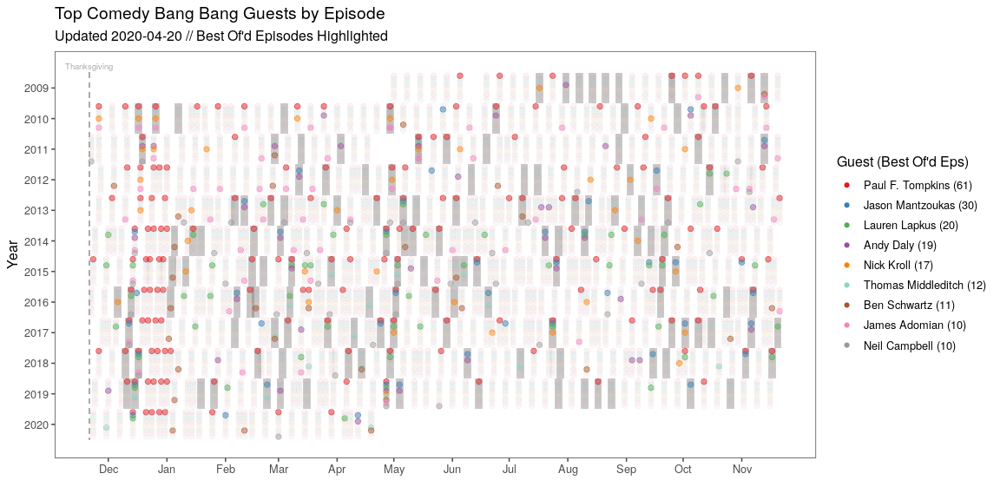

CBB Best Ofs Episodes
================
05-January-2020

Comedy Bang Bang is an alt-comedy improv podcast published at least
weekly since 2009. Each episode features one or more guests, who may be
playing themselves or an improvised character. As of 2020-01-05, there
have been 677 mainline episodes with 478 unique guests.

At the end of the year, listeners vote on the best episodes of the year
(Thanksgiving-to-Thanksgiving), which are compiled in year-end Best Of
episodes that are published over the Christmas-New Year break. Paul F.
Tompkins, the most frequent CBB guest, typically cohosts these shows
with the show’s host, Scott Aukerman.

In 2017, there was a lot of Scott-and-Paul talk in the Best Ofs about
the frequency in which Paul appears in Best Of’d episodes, I wanted to
visualize the data to see whether this was because Paul makes episodes
good, or it he’s just in a lot of episodes. To do this, I scraped the
data directly from the Earwolf website using the `scrape-earwolf.R`, and
then created the image via `cbb-bestof-figure.R`.

<!-- -->
